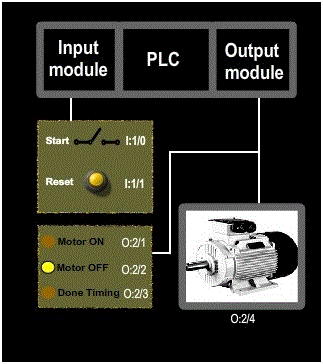
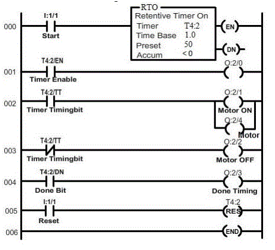
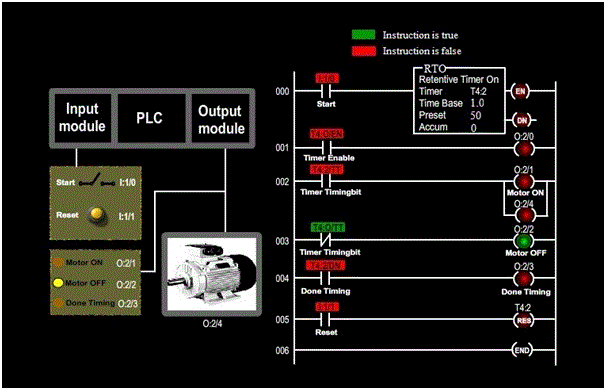
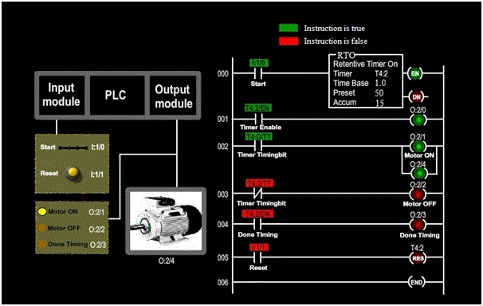
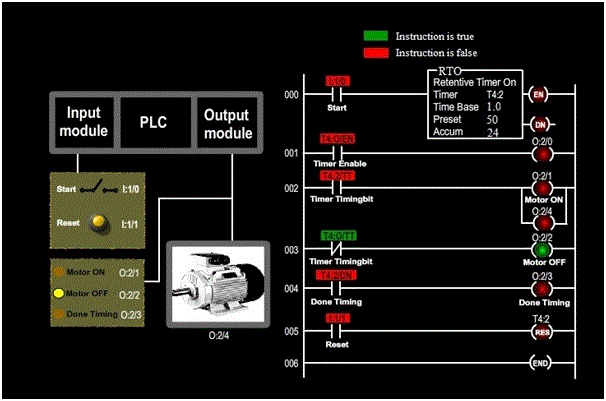
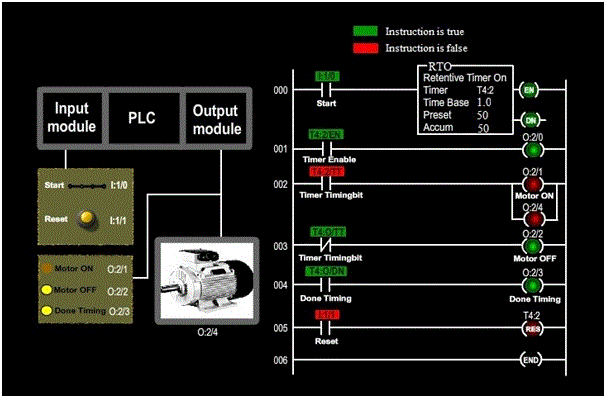

### Aim of the experiment: PLC Retentive Timer - On Instruction

<strong>Aim</strong>: To understand the working of retentive timer on instruction in a PLC. 

### Procedure:

<strong>Procedure</strong>: In our experiment, our motor needs a maintenance after 50 seconds (just for demonstration purpose) of running time. So a retentive timer of 50 seconds is used.  
Let us see the basic diagram of the circuitry:

<ul type=disc style="text-align: justify;">
<li>Since the inputs and outputs are less, 8-points input module and 8-points output module is sufficient, where CPU resides in slot 0, input module resides in slot 1 and output module resides in slot 2.</li>

<li>In our experiment, we want our motor to run for a predetermined time ( 50 seconds ) before it is sent for maintenance. So the retentive timer instruction of 50 seconds in used to track the running time of motor for maintainance. </li>

<li>Here, one switch is used to turn the motor ON or OFF and one push button of normally open type is used to reset the timer. The working status of the motor and timer is displayed using LED’s. When the motor is running, motor ON LED will glow. When the motor is not running, motor OFF LED will glow. When the timer has done timing, Done timing LED will glow. </li>

<li>Let us assign address for the input and output signals of the PLC:   
&nbsp;&#10147; Start (switch) : I:1/0   
&nbsp;&#10147; Reset (normally open push button) : I:1/1   
&nbsp;&#10147; Motor OFF (LED) : O:2/2   
&nbsp;&#10147; Done timing (LED) : O:2/3  </li>
&nbsp;&#10147; Motor: O:2/4  </li>
 

<li>Let us see the ladder diagram: 

</li>

<li>In order to see how the retentive timer on instruction works in a PLC, click (toggle) start switch and observe the retentive timer-on instruction. Also, observe the LED and motor correspondingly.
</li></ul>

The following screen shots explain the operation: 

 
The above screen shot represents the condition when the motor is off and the timer is reset. 

 
The above screen shot represents the condition when the motor is running and timer is timing.
 

 
The above screen shot represents the condition when the motor is off, and the timer has retained its accumulated value. 

 
The above screen shot represents the condition when the motor is off, and the timer has retained its accumulated value. 
