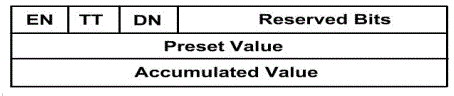
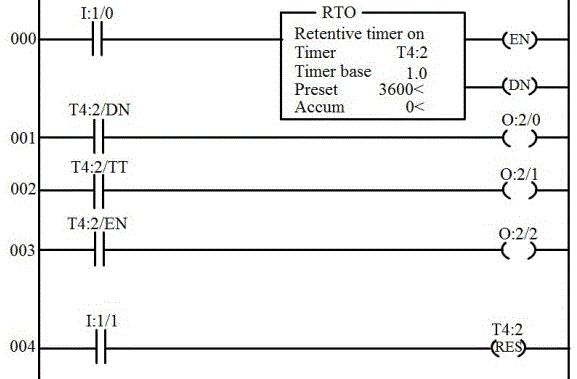

### Introduction 

### TIMERS :

All PLC’s have timer instructions. Timers are output instructions that are internal to the programmable logic controller. Timers provide timed control of the devices that they activate or de-activate. 

#### Basic functions of timer :
<ul type=disc>
<li>Timers are used to delay an action.</li>
<li>Timers are used to run an operation for a predetermined period of time.</li>
<li>Timers are also used to record the total accumulated time of continuous or intermediate events.</li>
</ul>

#### Timer’s instructions :

Timers consists of following parts: timer address, preset value, timer base, and accumulated value, as shown in
 figure below.

fig(a)
 
In the above figure , term instruction name is, timer on delay ( TON ), timer base is 1.0 seconds, timer address is T4:0,
accumulated value of zero(0) and a preset value of 200. 
Each timer instruction has three very useful status bits. These bits are timer enable (E N), timer timing (TT), and timer
done(DN).  
There are 3 types of timers: On- delay timer, Off-delay timer, and retentive timer.

#### On delay timer :
<ul type=disc>
<li>Use this instruction to program a time delay after instructions become true. </li>
<li>On – delay timers are used when an action is to begin a specified time after the input becomes true. For example, a
certain step in the manufacturing is to begin 45 seconds after a signal is received from a limit switch. The 45- seconds delay
 is the on-delay timers preset value. </li>
</ul>

#### Off- delay timer :
<ul type=disc>
<li>Off- delay timer instructions is used to program a time delay to begin after rung input goes false. </li>
<li> As an example, when an external cooling fan on a motor is provided, the fan has to run all the time the motor is running
 and also for certain time (say 10min) after the motor is turned off. This is a ten minute off- delay timer. The ten-minute
 timing period begins as soon as the motor is turned off. </li>
</ul>

#### Retentive timer :
<ul type=disc>
<li>Retentive timer is a timer which retains the accumulated value in case of power loss, change of processor mode or rung
state going from true to false (rung state transition).</li>
<li>Retentive timer can be used to track the running time of a motor for its maintenance purpose. Each time the motor is
turned off, the timer will remember the motor’s elapsed running time. The next time the motor is turned on, the time will
increase from there. This timer can be reset by using a reset instruction. </li>
</ul>

##### Reset :
<ul type=disc>
<li>This instruction is used to reset the accumulated value of counter or timer. </li>
<li>It is used to reset a retentive timer’s accumulated value to zero. </li>
</ul>

##### A typical timer element :

A timer element is made up of three 16 bit words:

<ul type=disc>
<li>Word 0 &#8594; 3 status bits (EN, TT, DN). </li>
<li>Word 1 &#8594; Preset values. </li>
<li>Word 2 &#8594; Accumulated value. </li>
</ul>

fig(b)

##### How do we address a timer?
Addressing a timer is as follows:  
<ol type="1">
<li>The address format in order to address the timer element is T4:3  
          Where, T = T identifies this as a timer file.  
                       4 = represents the default timer file 4.  
                     <strong> Note</strong>: SLC timer can be assigned any unused file from 9
                                to 255.  
                      :3 = This is timer three in file 4. There are 256 timers
                              available in each file. Timers 0 through 255 are
                              available .   
</li>
<li>Preset value of the timer can be addressed in the following way:T4:3.PRE  
           Where, T= identifies this as a timer file.  
                        4= represents the default timer file 4. 
                       :3= timer 3 in file 4.  
                       . = this point is the word delimiter. It separates the timer number, called the structure, from the subelements.
                            Here the subelement is PRE, for preset value.  
</li>
<li>Accumulated value of the timer can be addressed as shown below:T4:3.ACC  
            Where, T= identifies this as a timer file.  
                         4= represents the default timer file 4. 
                        :3= timer 3 in file 4.  
                        . = this point is the word delimiter. It separates the timer number, called the structure, from the subelements.
                            Here the subelement is ACC, for accumulated value.   
</li>
</ol>

&#8658; The status bits of the timer can be addressed in the following way:
<ul type=disc>
<li>Word zero, bit 13, is the done bit. It is identified as DN.
  This bit is set when the timer’s accumulated value is
   equal to the timer’s preset value. It can be addressed as
   T4:3/DN.        </li>
<li>Word zero, bit 14, is the timer timing bit. It is identified
   as TT. TT is set when the timer is timing. It is
   addressed as T4:3/TT. </li>
<li> Word zero, bit 15, is the timer enable bit. It is identified
   as EN. EN bit is set whenever the timer is enabled. It is
     addressed as T4:3/EN. </li>
</ul>

#### The on-delay timer instruction :

fig(c)
 
The above figure is used to explain the on-delay timer instruction. 
Here, T4:2 represents timer file 4, timer element 2, preset value is 50, accumulated value is 0 and timer base is 1 second.
Input module is in slot 1 and output module is in slot 2.  

<ul type=disc>
<li>As long as the instruction I:1/0 is true, the on-delay timer T4:2 will increment every one second toward its preset value
 of 50 seconds. The accumulated value displays the current number of seconds that passed. When the accumulated value
 is equal to the preset value, the timer’s done bit will get energized or set. So when the timer’s done bit gets energized, the
 rung 003, instruction T4:3/DN becomes true and logical continuity is passed and the output O:2/2 gets energized. </li>

<li>As long as the I:1/4 is true, the timer instruction is enabled. Hence, rung 000 becomes true and logical continuity is
passed and the output O:2/0 is energized.  
Note: An on-delay timer is not retentive in nature.so any loss of continuity to the timer instruction on rung 000 will cause
the timer to reset itself to an accumulated value of 0. </li>
<li>When the timer is timing i.e rung 000 is true and accumulated value is less than preset value, timer timing bit(TT) is true.
 So the rung 002 becomes true i.e instruction T4:2/TT is true and output instruction O:2/1 is energized. 
Note: As long as the rung 000 is true i.e instruction I:1/0 is true, the timer instruction is considered enabled. The enable bit
will be true when the timer timing bit is true. Timer enable bit will be set through the transition from the timer-timing bit to the
 timer-done bit. Timer enable bit is set as long as there is logical continuity through all input instructions to the timer
instruction, no matter the relationship between the preset value and accumulated value. When the rung goes false, the
 enable bit is reset.  </li>
</ul>

#### The off-delay timer instruction :

fig(d)
 
The above figure is used to explain the off-delay timer instruction. Here, T4:2 represents timer file 4, timer element 2,
preset value is 200, accumulated value is 0 and timer base is 1 second. Input module is in slot 1 and output module is in
 slot 2.  
<ul type=disc>
<li>As an example, consider an external cooling fan on a motor which has to run all the time when the motor is running and
 also for 200 seconds after the motor is turned off. For this purpose, we use 200- second off-delay timer. The 200-second
 timing cycle begins when the motor is turned off. </li>
<li> When the instruction I:1/0 is true, the motor is turned on i.e instruction O:2/0 becomes true. In other words, rung 000
becomes true. When the instruction I:1/0 is true, rung 001 becomes true, which will make the off-delay timer T4:2 enable.
 So as long as the instruction I:1/0 is true, the timer enable bit, EN, is true and hence, rung 002 become true, which inturn
makes the output instruction O:2/1 true. The done bit is set as long as the rung 001 is true i.e the done bit is set when the
 enable bit is set. So the rung 004 is true. Hence, the external cooling fan is energized i.e instruction O:2/3 is true. So at
this point, both motor and external cooling fan are energized. </li>
<li>When the motor is turned off, i.e the instruction I:1/0 becomes false, the output instruction O:2/0( motor) becomes false
and motor is turned off. When rung 001 transitions from true to false, the TOF( off-delay timer) instruction begins timing.
The done bit and the external cooling fan( O:2/3) will still remains on, or true, for the preset value of 200 seconds. The time
period between the point when the rung becomes false and the point when the 200 seconds preset time expires for T4:2 is
 called delay after the input goes false, or the off-delay. The timers done bit and its associated output stay true until the
 off-delay of 200- seconds expires. The time expires when the accumulated value reaches the preset value. When the input
instruction I:1/0 goes from true to false, the timer enable bit (EN) is reset and timer timing bit(TT) is set. The timer will start
 timing at this point. The timer timing bit(EN) becomes true whenever the rung transitions from true to false and the
accumulated value is less than the preset value. 
Note: The timer done bit, bit 13, is set when the rung 000 becomes true. It will remain set through the true to false transition
 and until the accumulated value is equal to the preset value. This bit is commonly used to control the other logic when an
 output needs to be turned-on or turned-off after its rung has been off for the preset time interval. </li>
</ul>

#### The retentive timer instruction :

Retentive timer instruction is used when we want to retain the accumulated value through power loss, processor mode
 change, or change in the rung state from true to false. The retentive timer instruction will measure the cumulative time
 period for which its rung is true. One of the example of retentive timer is that, it can be used to track the running time of a
motor for maintenance purpose. The retentive timer is used to track the accumulated time the motor has run. In our example
, our motor needs maintenance after 3600 seconds or, one hour of running time. Each time the motor is turned off, the timer
needs to remember the motors total elapsed running time. The next time the motor is turned on, the timer will increase the
 accumulated running time from where it is left off. When the total accumulated motor running time has been reached, a
maintenance remainder pilot light will be lit. A retentive timer is used in this application.

fig(e)
 

Here, T4:2 represents timer file 4, timer element 2, preset value is 3600, accumulated value is 0 and timer base is 1
 second. Input module is in slot 1 and output module is in slot 2.  
The retentive timer on, RTO instruction, behaves similar to the timer-on delay instruction, with exception that when the RTO
instruction goes false, it will retain its accumulated value.  
The retentive timer will retain its accumulated value during the following conditions: 

<ul type=disc>
<li>When its rung goes false.</li>
<li>When processor losses power. But, the battery for memory back up must be in good condition. </li>
<li>When the processor faults. </li>
<li>When the processor operating mode is changed from remote run or remote test to remote program mode.</li>
</ul>

##### Associated status bit :

The timer done bit, bit 13, is set when the accumulated value is equal to the preset value. For our application, the done
 bit and output O:2/0 could control the maintenance reminder pilot light.  
Timer timing bit(TT), bit 14, is on rung 002. This bit is set anytime the rung conditions are true and the timer times. The timer
times whenever the rung is true and the accumulated value is less than the preset value. When the done bit is set, the
timer timing bit resets. So in our example, the timer timing bit will be set or true, whenever input I:1/0 is true and as long as
 the accumulated value is less than the preset value of 3600 seconds. Output O:2/1 will be on or true when the timer is
 timing between 0 second and 300 seconds. As the done bit is set and O:2/0 turns on, the timer timing bit goes false and
 O:2/1 turns off.  
The timer enable bit, 15, is set or true , anytime the timer instruction rung 000 is true. As long as the instruction I:1/0 is true,
the timer instruction is considered enabled. The enable bit is true when the timer-timing bit is true and it will stay set through
 the transition from the timer-timing bit to the timer done bit.

##### The reset instruction :

In order to reset the accumulated value of retentive timer, a reset instruction is used. The address of the reset instruction
 must match the address of the timer that is to be reset. Only one address is allowed per reset instruction. In rung 004,
 I:1/1 instruction is used to reset the timer T4:2. This signal comes from a momentary normally open push button field
device, connected to input screw terminal 1. Pressing this push button will reset the RTO’s accumulated value back to 0. 

<strong>NOTE</strong>: Retentive timer off instruction behaves similar to the timer-off delay with the exception that when the
 instruction goes from false to true, it will retain , or remember, its accumulated value.

